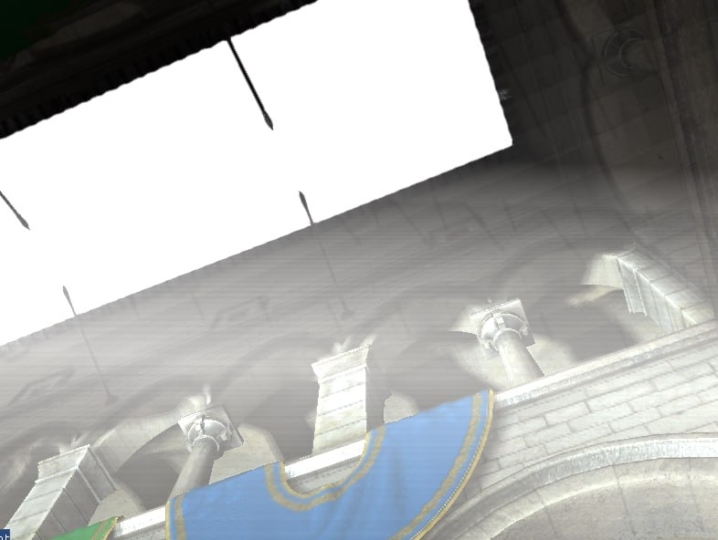

# 🎮 OpenGL Deferred Renderer

A real-time 3D renderer built with **OpenGL 3.3 Core Profile**, featuring a full deferred shading pipeline with physically-based lighting, post-processing effects, and an interactive ImGui debug interface.



---

## ✨ Features

### 🏗️ Core Architecture

- **Deferred Shading Pipeline** — Geometry and lighting are decoupled into separate passes, allowing efficient rendering of multiple light sources without per-object lighting overhead
- **G-Buffer Layout**
  - `GL_COLOR_ATTACHMENT0` — View-space position (RGB16F)
  - `GL_COLOR_ATTACHMENT1` — View-space bump normal (RGB16F)
  - `GL_COLOR_ATTACHMENT2` — Albedo (RGB) + Specular/Reflectivity (A)
- **Model Loading** — Assimp-based OBJ/FBX loader with diffuse, specular, normal, and height map support
- **Normal Mapping** — Height-field-derived bump normals computed via screen-space derivatives (`dFdx` / `dFdy`)
- **GLFW + GLAD** — Modern OpenGL context and input management (migrated from FreeGLUT + GLEW)

---

### 💡 Lighting

- **Point Light Shadow Mapping** — Omnidirectional shadow cubemap rendered with a geometry shader that emits 6 faces in a single pass
- **PCF Shadow Bias** — Dynamic bias computed from the angle between surface normal and light direction to minimize shadow acne
- **Deferred Point Lights** — Per-light radius attenuation with linear and quadratic falloff terms
- **SSAO (Screen Space Ambient Occlusion)** — 64-sample hemisphere kernel in view space, followed by a 5×5 box blur pass to smooth the occlusion result

---

### 🌊 Post-Processing Stack

All post-processing passes run as fullscreen quad draws after the main deferred lighting pass.

| Pass | Input | Output |
|------|-------|--------|
| Shadow | Scene geometry | Depth cubemap |
| G-Buffer | Scene geometry | gPosition, gNormal, gAlbedoSpec |
| SSAO | gPosition, gNormal | Occlusion buffer |
| SSAO Blur | Occlusion buffer | Blurred occlusion |
| Lighting | G-Buffer + Shadow cubemap + SSAO | `sceneColorTex` |
| SSR | G-Buffer + `sceneColorTex` | `ssrTex` |
| SSR Composite | `sceneColorTex` + `ssrTex` | Updated `sceneColorTex` |
| God Rays | `occlusionTex` + `sceneColorTex` | `fxaaTex` |
| FXAA | `fxaaTex` | Screen |

#### 🔮 Screen Space Reflections (SSR)
- View-space ray marching against the G-buffer depth
- Fresnel-weighted blending (Schlick approximation)
- Floor-surface prioritization via normal Y-component masking
- Edge fade, facing-angle fade, and ray-length fade to hide artifacts
- Tunable: Max Distance, Thickness, Strength

#### ☀️ God Rays (Light Scattering)
- Radial screen-space ray marching from the projected light source position
- Occlusion mask rendered in a separate pass — geometry occludes the light
- Tunable: Density, Weight, Decay, Exposure

#### 🔲 FXAA (Fast Approximate Anti-Aliasing)
- Luma-based edge detection using a 2×2 diagonal neighbor sample
- Direction-weighted blur along detected edges
- Two-span validation to prevent over-blurring in low-contrast regions
- Tunable: Luma Threshold, Max Span

---

### 🎛️ ImGui Debug Interface

An interactive panel is overlaid on the scene (toggle mouse lock with **Tab**):

- **Light** — Drag light position in 3D, color picker
- **SSAO** — Radius, Bias, Kernel Size sliders
- **FXAA** — Luma Threshold, Max Span sliders
- **SSR** — Max Distance, Resolution, Thickness, Strength sliders
- **FPS Counter** — Live framerate display in the top-left corner

---

## 🛠️ Dependencies

| Library | Purpose | Version |
|---------|---------|---------|
| [GLFW](https://www.glfw.org/) | Window, context, input | 3.4 |
| [GLAD](https://glad.dav1d.de/) | OpenGL function loader | GL 3.3 Core |
| [GLM](https://github.com/g-truc/glm) | Mathematics | 0.9.x |
| [Assimp](https://github.com/assimp/assimp) | Model loading | 5.x / 6.x |
| [STB Image](https://github.com/nothings/stb) | Texture loading | Latest |
| [ImGui](https://github.com/ocornut/imgui) | Debug UI | 1.89.x |

---

## 🚀 Building (Windows, Visual Studio)

### Prerequisites
- Visual Studio 2019 or 2022
- All dependencies pre-compiled and placed under `Externals/`

### Directory structure
```
AS2_Framework/
  Externals/
    Include/
      GLFW/       ← glfw3.h
      glad/       ← glad.h
      KHR/        ← khrplatform.h
      GLM/
      imgui/
        backends/ ← imgui_impl_glfw.h, imgui_impl_opengl3.h
      STB/
      assimp/
    Libs/
      VC/
        glfw3.lib
        assimp.lib
  Source/         ← .cpp and .glsl files
  Models/
    sponza/       ← sponza.obj + textures/
```

### Steps
1. Open `AS2_Framework.sln` in Visual Studio
2. Set configuration to **Debug x64**
3. Place the following DLLs next to the output `.exe`:
   - `glfw3.dll`
   - `assimp.dll` (or `assimp-vc143-mt.dll`)
4. Press **F5** to build and run

---

## 🎮 Controls

| Key / Input | Action |
|-------------|--------|
| `W A S D` | Move camera |
| Mouse | Look around (when locked) |
| `Tab` | Toggle mouse lock / ImGui interaction |
| `Esc` | Exit |

---

## 📁 Shader Files

| File | Description |
|------|-------------|
| `g_buffer.vs/fs.glsl` | Geometry pass — fills G-buffer with position, normal, albedo |
| `deferred_shading.vs/fs.glsl` | Lighting pass — deferred point light evaluation with shadows |
| `ssao.fs.glsl` | SSAO occlusion computation |
| `ssao_blur.fs.glsl` | Box blur on the SSAO buffer |
| `ssr.fs.glsl` | Screen space reflection ray marching |
| `ssr_composite.fs.glsl` | Blends SSR result over the lit scene |
| `godrays.vs/fs.glsl` | Radial light scattering post-process |
| `occluder.vs/fs.glsl` | Renders occluder geometry for god rays |
| `fxaa.fs.glsl` | FXAA anti-aliasing final pass |
| `point_shadows_depth.vs/gs/fs.glsl` | Shadow cubemap generation |

---

## 📸 Screenshots

> _Add screenshots of your renderer here_

| Deferred Lighting | SSAO | SSR | God Rays |
|---|---|---|---|
|  |  |  |  |

---

## 📚 References

- [LearnOpenGL — Deferred Shading](https://learnopengl.com/Advanced-Lighting/Deferred-Shading)
- [LearnOpenGL — SSAO](https://learnopengl.com/Advanced-Lighting/SSAO)
- [LearnOpenGL — Point Shadows](https://learnopengl.com/Advanced-Lighting/Point-Shadows)
- [Morgan McGuire — Screen Space Ray Tracing](https://casual-effects.blogspot.com/2014/08/screen-space-ray-tracing.html)
- [Nvidia — FXAA Whitepaper](https://developer.download.nvidia.com/assets/gamedev/files/sdk/11/FXAA_WhitePaper.pdf)
- [GPU Gems 3 — Volumetric Light Scattering](https://developer.nvidia.com/gpugems/gpugems3/part-ii-light-and-shadows/chapter-13-volumetric-light-scattering-post-process)

---

## 📝 License

This project was developed as an academic assignment. Model assets (Sponza) are from [Morgan McGuire's Computer Graphics Archive](https://casual-effects.com/data/).
